# Грим та Грім - Офіційний сайт

Сучасний веб-сайт українського рок-гурту «Грим та Грім», побудований на Next.js 16 з акцентом на продуктивність, доступність та SEO-оптимізацію.

## 🎯 Про проект

«Грим та Грім» — це офіційний сайт українського рок-гурту, який демонструє сучасний підхід до веб-розробки. Проект створений з використанням передових технологій для забезпечення найкращого користувацького досвіду та максимальної видимості в пошукових системах.

### Ключові особливості

- **Повністю адаптивний дизайн** для всіх пристроїв
- **SEO-оптимізація** з розширеними структурованими даними
- **WCAG 2.1 AA сумісність** для доступності
- **Ліниве завантаження** медіа-контенту
- **Паралакс-ефекти** для покращення UX
- **Інтерактивна карта** розташування
- **Автоматизоване тестування** з Playwright
- **Захищена контактна форма** з валідацією та обмеженнями

## 🚀 Технологічний стек

### Core Framework

- **Next.js 16** - React framework з App Router
- **React 19** - UI бібліотека
- **TypeScript 5** - Типобезпека

### Styling & UI

- **Tailwind CSS 4** - Utility-first CSS фреймворк
- **shadcn/ui** - Компонентна бібліотека
- **Radix UI** - Доступні компоненти
- **class-variance-authority** - Варіативність стилів

### SEO & Performance

- **react-schemaorg** - Структуровані дані Schema.org
- **schema-dts** - Типізація Schema.org
- **next/font** - Оптимізація шрифтів

### Testing & Quality

- **Playwright** - E2E тестування та скриншот-тестування
- **React Doctor** - Аналіз якості React-коду
- **ESLint** - Лінтинг коду

### Package Manager

- **pnpm** - Ефективне управління залежностями

### Contact Form & Security

- **React Hook Form** - Advanced form management with Controller pattern
- **shadcn/ui Forms** - Custom form components (Field, Input, Textarea)
- **Arcjet** - Bot protection, shield, and 5-minute rate limiting per IP for email endpoint
- **Resend** - Email delivery service for contact submissions
- **Zod v4** - Schema validation with manual resolver compatibility
- **Sonner** - Toast notifications for user feedback

## 📁 Структура проекту

```text
├── app/                    # Next.js App Router
│   ├── api/               # API маршрути
│   │   └── contact/       # API для контактної форми
│   ├── layout.tsx         # Кореневий layout
│   ├── page.tsx           # Головна сторінка (композиція секцій)
│   └── globals.css        # Глобальні стилі
├── components/                   # React компоненти
│   ├── sections/               # Секції сторінки (модульна структура)
│   │   ├── Header.tsx         # Навігаційний хедер з мобільним меню
│   │   ├── HeroSection.tsx    # Головний герой-секшн з паралаксом
│   │   ├── UpcomingEvents.tsx # Секція майбутніх концертів
│   │   ├── BandMembers.tsx    # Секція учасників гурту
│   │   ├── AboutSection.tsx   # Секція "Про гурт" з відео
│   │   ├── ContactSection.tsx # Секція контактів з формою
│   │   └── Footer.tsx         # Футер з навігацією та соцмережами
│   ├── ui/                      # shadcn/ui компоненти
│   │   ├── button.tsx          # Кнопка з варіантами (cta, submit)
│   │   ├── field.tsx           # Компоненти полів форми
│   │   ├── input.tsx           # Поле вводу форми
│   │   ├── input-group.tsx     # Групи елементів форми
│   │   └── video-container.tsx # Відео контейнер з анімаціями
│   ├── ContactForm.tsx     # Контактна форма з валідацією
│   ├── SEOHead.tsx        # SEO мета-теги та Schema.org
│   ├── GoogleMap.tsx      # Google Maps інтеграція
│   ├── LazyGoogleMap.tsx  # Ліниве завантаження карти з плейсхолдером
│   └── TicketPopup.tsx    # Модальне вікно для квитків
├── hooks/                 # Кастомні React хуки
│   ├── useParallax.tsx    # Паралакс ефекти
│   ├── useVideoExpansion.tsx # Розширення відео
│   └── useVideoPreload.tsx # Завантаження відео
├── utils/                 # Утиліти
│   ├── consts.ts          # Константи проекту (концерти, зображення)
│   └── handleSmoothScroll.ts # Плавна прокрутка
├── lib/                   # Бібліотеки
│   └── utils.ts           # Загальні утиліти
├── tests/                 # Тести
│   └── screenshot-tests/  # Скриншот-тести
│       └── homepage.spec.ts
├── public/                # Статичні ресурси
└── spec/                  # Дизайн специфікації
```

## �️ Модульна архітектура секцій

Проект використовує модульний підхід до структури сторінки, де кожна секція є незалежним компонентом:

### Переваги модульної структури

- **Iзольованість** - Кожна секція може розроблятися та тестуватися окремо
- **Реюзабельність** - Секції можна легко перевикористовувати на інших сторінках
- **Легке підтримання** - Зміни в одній секції не впливають на інші
- **Оптимізація** - Можливість ліниво завантажувати окремі секції
- **Тестування** - Скриншот-тести для кожної секції окремо

### Композиція сторінки

Головна сторінка (`app/page.tsx`) є композицією секцій:

```tsx
<Header />
<HeroSection />
<UpcomingEvents openTicketPopup={openTicketPopup} />
<BandMembers />
<AboutSection 
  aboutSectionRef={aboutSectionRef}
  aboutVideoRef={aboutVideoRef}
  aboutTextRef={aboutTextRef}
  videoExpanded={videoExpanded}
/>
<ContactSection />
<Footer />
```

### Доступні секції

- **Header** - Навігація з мобільним меню та плавною прокруткою
- **HeroSection** - Головний екран з паралакс-ефектом та CTA кнопками
- **UpcomingEvents** - Секція концертів з модальними вікнами для квитків
- **BandMembers** - Карточки учасників гурту з анімаціями
- **AboutSection** - Інформація про гурт з відео та інтерактивними елементами
- **ContactSection** - Контактна форма з інтегрованою картою
- **Footer** - Футер з навігаційними посиланнями та соцмережами

## 🎨 Реалізація Favicon

Проект використовує комплексну налаштування favicon, згенеровану за допомогою [RealFaviconGenerator](https://realfavicongenerator.net/) для оптимальної сумісності між платформами.

### Згенеровані файли

Усі файли favicon розташовані в директорії `app/` для сумісності з Next.js App Router:

- `icon0.svg` - Основний SVG favicon
- `icon1.png` - PNG favicon резервна копія
- `favicon.ico` - Традиційний ICO favicon
- `apple-icon.png` - Apple touch icon
- `manifest.json` - Web app manifest

### Ікони Web App Manifest

Додаткові ікони маніфесту зберігаються в директорії `public/`:

- `web-app-manifest-192x192.png` - 192x192 PWA іконка
- `web-app-manifest-512x512.png` - 512x512 PWA іконка

### Верифікація

Для перевірки реалізації favicon:

```bash
# Перевірити реалізацію favicon на порту 3000
npx realfavicon check 3000
```

Ця команда перевіряє, що всі файли favicon правильно налаштовані та доступні на різних платформах та пристроях.

### Процес генерації

Favicon було згенеровано за допомогою [RealFaviconGenerator](https://realfavicongenerator.net/), який надає:
- Сумісність між платформами (iOS, Android, Windows, macOS)
- Підтримку множинних форматів (SVG, PNG, ICO)
- Генерацію web app manifest
- Оптимізацію PWA

## 🎨 Компоненти та функціональність

### Секційні компоненти

#### Header.tsx

- **Sticky навігація** з backdrop blur ефектом
- **Responsive меню** з Sheet компонентом для мобільних пристроїв  
- **Плавна прокрутка** до секцій з handleSmoothScroll
- **Accessibility** підтримка з правильними ARIA атрибутами

#### HeroSection.tsx

- **Паралакс-ефект** для фонового зображення через CSS custom properties
- **Responsive зображення** з різними source для desktop/mobile
- **CTA кнопки** для конверсії користувачів
- **Priority завантаження** з fetchPriority="high"

#### UpcomingEvents.tsx

- **Динамічний список концертів** з consts.ts
- **Модальні вікна** для покупки квитків через TicketPopup
- **Responsive карточки** з hover ефектами
- **Інтеграція** з зовнішніми сервісами квитків

#### BandMembers.tsx

- **Карточки учасників** з фотографіями та описами
- **Responsive grid** layout для різних екранів
- **Hover анімації** для покращення UX
- **Оптимізовані зображення** з Next.js Image

#### AboutSection.tsx

- **Відео контент** з лінивим завантаженням
- **Інтерактивне розширення** відео при прокрутці
- **Responsive текст** з адаптивними розмірами
- **Hook інтеграція** з useVideoExpansion та useVideoPreload

#### ContactSection.tsx

- **Контактна форма** з валідацією та rate limiting
- **Інтегрована карта** Google Maps з лінивим завантаженням
- **Toast notifications** для фідбеку користувачів
- **Security** захист через Arcjet

#### Footer.tsx

- **Навігаційні посилання** з плавною прокруткою
- **Соціальні мережі** з іконками та посиланнями
- **Контактна інформація** в структурованому форматі
- **Responsive layout** для різних пристроїв

### Утилітарні компоненти

#### SEOHead.tsx

Компонент для SEO-оптимізації:

- **Meta теги**: Open Graph, Twitter Cards, Geo теги
- **Структуровані дані**: Schema.org для MusicGroup та MusicEvent
- **Мультиязичність**: Підтримка української локалізації
- **Event розмітка**: Автоматична генерація для концертів

### GoogleMap.tsx

Інтеграція Google Maps з:

- **Ліниве завантаження** для продуктивності
- **Налаштовувані параметри**: zoom, pitch, heading
- **Responsive дизайн** для всіх пристроїв
- **Accessibility** підтримка

### LazyGoogleMap.tsx

Оптимізована версія Google Maps:

- **Відкладене завантаження** через 2 секунди після page load
- **Плейсхолдер з анімацією** завантаження
- **Suspense fallback** для кращого UX
- **Мемоізація** компонента для ефективності

### VideoContainer.tsx

Комплексний компонент для відео контенту:

- **VideoContainer**: Основний контейнер з float/expanded логікою
- **VideoWrapper**: Обгортка з hover ефектами
- **VideoImage**: Статичне зображення з opacity анімаціями
- **VideoElement**: Відео елемент з ref підтримкою
- **VideoBackdrop**: Декоративний фон
- **CVA варіанти**: Розширення/звуження з плавними переходами

### ContactForm Component

Сучасна контактна форма з розширеним функціоналом:

- **React Hook Form**: Управління формою з Controller pattern
- **shadcn/ui Components**: Field, Input, InputGroup, InputGroupTextarea
- **Real-time Validation**: Zod schema з ручною валідацією для сумісності з v4
- **Rate Limiting**: 5-хвилинне обмеження на IP з відображенням таймера
- **Toast Notifications**: Sonner для користувацького фідбеку
- **Accessibility**: Правильні ARIA атрибути та семантика
- **Character Counter**: Лічильник символів для поля повідомлення
- **Auto-disable**: Форма автоматично блокується при досягненні ліміту

### TicketPopup.tsx

Модальне вікно для покупки квитків:

- **Динамічне завантаження** URL квитків через concertDateUrls
- **Responsive дизайн** для мобільних та десктопних пристроїв
- **Закриття по Escape** та кліку на backdrop
- **Accessibility** підтримка з правильними ARIA атрибутами
- **Smooth анімації** відкриття/закриття

### Button Component

Розширена кнопка з варіантами:

- **cta variant**: Для головних закликів до дії
- **submit variant**: Для форм з hover ефектами
- **asChild**: Підтримка рендерингу як інші елементи
- **Radix UI integration**: Доступність та функціональність

### Form UI Components

Сучасні компоненти для форм з shadcn/ui:

- **Field**: Базовий контейнер для полів форми з орієнтацією
- **FieldLabel**: Семантичні лейбли з правильними прив'язками
- **FieldDescription**: Додатковий опис для полів форми
- **FieldError**: Відображення помилок валідації
- **FieldGroup**: Групування полів форми
- **Input**: Стилізовані поля вводу з фокус станами
- **InputGroup**: Контейнер для складних елементів форми
- **InputGroupAddon**: Додаткові елементи (счетчики, іконки)
- **InputGroupText**: Текстові елементи в групах вводу
- **InputGroupTextarea**: Стилізовані текстові області

## 🏗️ Архітектура компонентів

### Component Variants (CVA)

Використання `class-variance-authority` для гнучкості:

- **VideoContainer**: Expanded/collapsed стани
- **Button**: Multiple variants (cta, submit, secondary)
- **Consistent styling**: Єдина система дизайн-токенів
- **Type safety**: TypeScript інтерфейси для всіх props

### Performance Optimizations

- **Lazy loading**: Google Maps та відео контент
- **Debounced scroll handlers**: Оптимізація прокрутки
- **Memoization**: useMemo для дорогих обчислень
- **Suspense boundaries**: Плавне завантаження компонентів
- **Smart preloading**: Відео завантажується при потребі

### Accessibility Features

- **Semantic HTML**: Правильна структура документа з `<header>`, `<main>`, `<nav>`, `<section>`, `<footer>`
- **ARIA attributes**: Базова підтримка з `aria-label`, `aria-labelledby`, `role` атрибутами
- **Focus indicators**: Візуальні стилі для `focus-visible` станів на кнопках та формах
- **Form accessibility**: Правильні `label` прив'язки через `htmlFor` та `id`
- **Screen reader support**: Alt тексти для зображень та семантична розмітка
- **Navigation structure**: Логічний порядок елементів для стандартної таб-навігації

### Кастомні хуки

#### useParallax

- Створює паралакс-ефект при прокрутці
- Оптимізований для продуктивності
- Вимикається в тестовому середовищі

#### useVideoExpansion

- **Debounce optimization**: 30ms затримка для плавності
- **Smart collapse logic**: Розширення/звуження з урахуванням напрямку прокрутки
- **Performance optimized**: useRef для стану та clearTimeout для cleanup
- Вимикається в тестовому середовищі

#### useVideoPreload

- Ліниве завантаження відео
- Завантажує при вході в viewport або через 15с
- Оптимізація bandwidth

## 📧 Contact Form & Security

### API Endpoint (`/api/contact`)

RESTful API для обробки контактних форм з розширеним захистом:

#### POST `/api/contact`

- **Validation**: Zod schema validation для name, email, message
- **Arcjet Protection**: Shield, bot detection, та rate limiting
- **Rate Limiting**: 1 submission per 5 minutes per IP
- **Email Delivery**: Resend інтеграція для відправки листів
- **Response Format**: JSON з rate limit інформацією

#### Security Features

- **Shield Protection**: Блокування загальних атак
- **Bot Detection**: Блокування всіх ботів (allow: [])
- **Fixed Window**: 1 request per 5 minutes per IP
- **IP-based Limiting**: Унікальні ліміти для кожної IP адреси

### Frontend Integration

- **Real-time Status**: Автоматична перевірка rate limit при завантаженні
- **Live Countdown**: Таймер зворотного відліку (MM:SS формат)
- **Form Disabling**: Автоматичне блокування при досягненні ліміту
- **Toast Notifications**: Sonner для user feedback
- **Auto-recovery**: Форма автоматично розблоковується після закінчення часу

## ♿ WCAG 2.1 AA Сумісність

Проект розроблений з дотриманням базових стандартів доступності:

### Семантична розмітка

- Правильне використання HTML5 тегів (`<header>`, `<main>`, `<nav>`, `<section>`, `<footer>`)
- ARIA атрибути для покращення навігації (`aria-label`, `aria-labelledby`)
- Логічна структура документа з правильним ієрархічним порядком

### Навігація та фокус

- **Стандартна таб-навігація** підтримується через природний порядок елементів
- **Focus-visible стилі** для інтерактивних елементів (кнопки, посилання)
- **Form focus management** через правильні label прив'язки
- **Покращення для клавіатури** можливі через додаткову імплементацію

### Контраст та читабельність

- Контрастність тексту відповідає WCAG AA вимогам
- **Чіткі фокус індикатори** на кнопках (`focus-visible:ring-3`)
- **Колірна контрастність** оптимізована для відповідності WCAG стандартам
- Масштабованість тексту без втрати функціональності

#### WCAG Color Contrast Validation

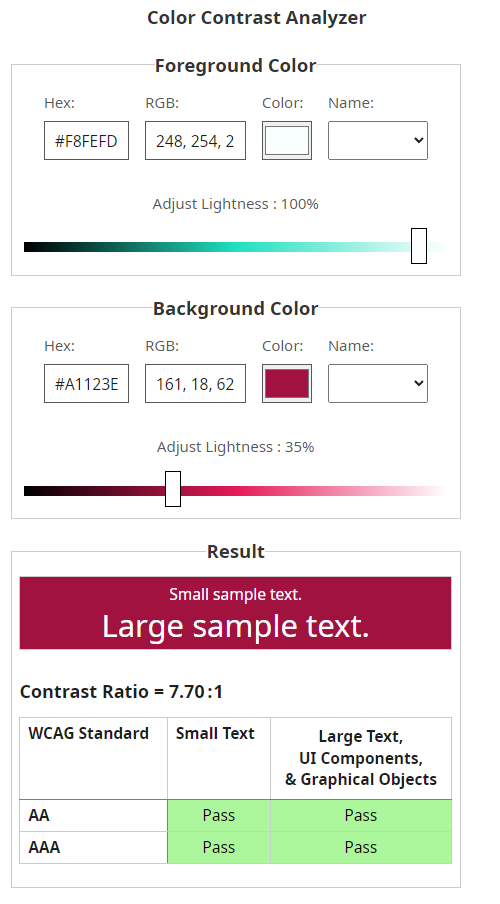

- **Змінено червоний колір кнопок** для відповідності WCAG AA вимогам
- **Використано інструменти** [Deque University Color Contrast](https://dequeuniversity.com/rules/axe/4.11/color-contrast) для валідації
- **Перевірено контрастність** для всіх текстових елементів та кнопок за допомогою Lighthouse report

### Медіа-контент

- Alt тексти для всіх зображень
- Семантична розмітка для відео контенту
- Описи для складних візуальних елементів

### Потенційні покращення

- Додаткові keyboard event handlers для Enter-навігації
- Skip links для швидкого доступу до контенту
- Розширена ARIA підтримка для динамічного контенту
- Focus trapping для модальних вікон (за потреби)

## 🔍 SEO Оптимізація

### Технічне SEO

- **Core Web Vitals** оптимізація
- **Meta теги** для всіх сторінок
- **Canonical URLs** та hreflang
- **Robots.txt** та sitemap.xml

### Структуровані дані

- **MusicGroup** schema для гурту
- **MusicEvent** schema для концертів
- **Organization** schema для контактів
- **BreadcrumbList** для навігації

### Контентна оптимізація

- Семантична HTML розмітка
- Оптимізовані зображення з WebP
- Ліниве завантаження медіа
- Мобільна оптимізація

## 🧪 Тестування

### Playwright Screenshot Testing

Детальна інформація в [README-PLAYWRIGHT.md](./README-PLAYWRIGHT.md)

#### Основні команди

```bash
# Запустити всі тести
pnpm test

# Оновити скриншоти
pnpm test:screenshot

# Запустити в headed режимі
pnpm test:headed

# Переглянути звіти
pnpm test:report
```

#### Структура тестів

- **Full page screenshots** для візуальної регресії
- **Component-level screenshots** для окремих секцій
- **Cross-browser тестування** (Chrome, Firefox, Safari)
- **Responsive тестування** (Desktop, Mobile, Tablet)

### React Doctor

Аналіз якості React-коду для виявлення проблем:

```bash
# Запустити повний аналіз
pnpm react-doctor

# Порівняти з попереднім станом
pnpm react-doctor:diff
```

React Doctor перевіряє:

- **Безпеку**: Вразливості та best practices
- **Продуктивність**: Оптимізація рендерингу
- **Архітектуру**: Структуру компонентів
- **Коректність**: Потенційні баги
- **Сумісність**: Versії залежностей

## 📈 Lighthouse Testing

Детальна інформація про тестування продуктивності з Lighthouse доступна в [README-LIGHTHOUSE.md](./README-LIGHTHOUSE.md)

### Performance Scores

.png)

.png)

### PageSpeed Insights

**[Desktop Performance Report](https://pagespeed.web.dev/analysis/https-lotoplay-five-vercel-app/q9qsp4wp04?form_factor=desktop)**

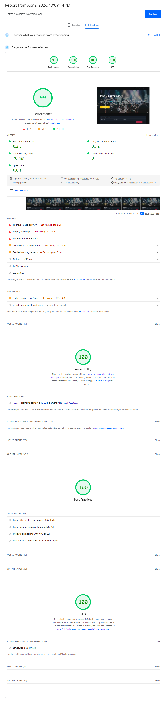

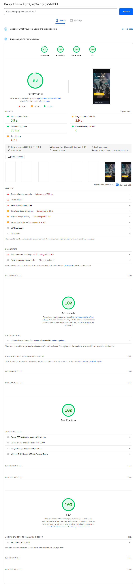

### Швидкі команди

```bash
# Основний тест (desktop)
pnpm lighthouse

# Мобільний тест
pnpm lighthouse:mobile

# Обидва тести
pnpm lighthouse:all

# Налаштування для WSL2
pnpm lighthouse:setup
```

### Звіти

- **Основний звіт**: [reports/lighthouse.html](./reports/lighthouse.html)
- **Мобільний звіт**: `reports/lighthouse-mobile.html`
- **Десктопний звіт**: `reports/lighthouse-desktop.html`

## 🎬 Playwright Comparison GIFs

### Page Sections

#### Header Navigation

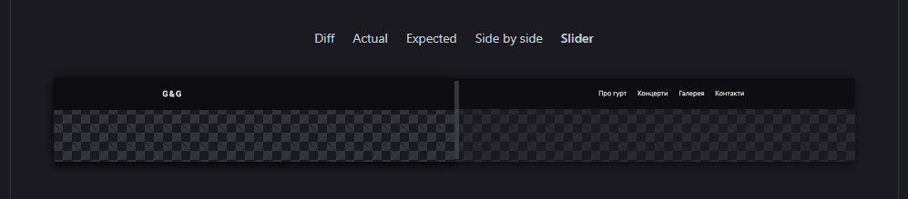

#### Hero Section

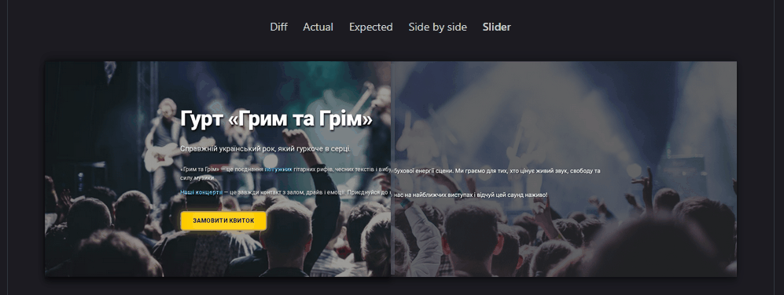

#### Band Members

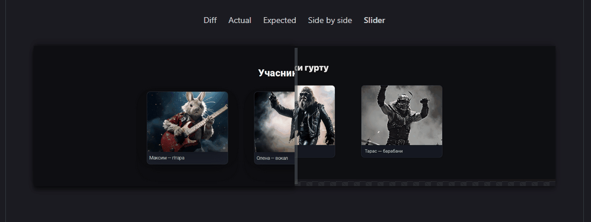

#### Concerts Section

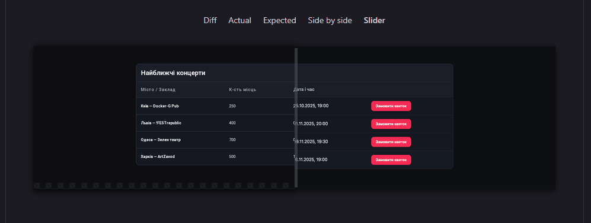

#### History Section

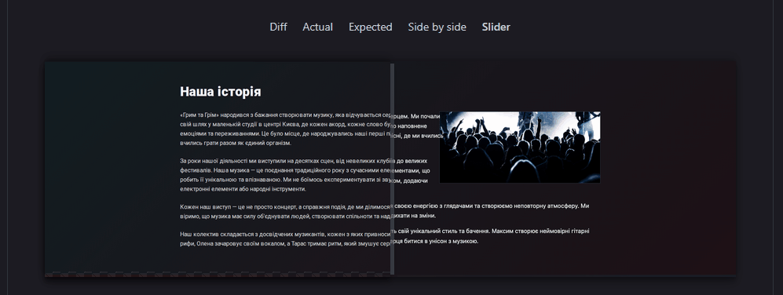

#### Contact Form

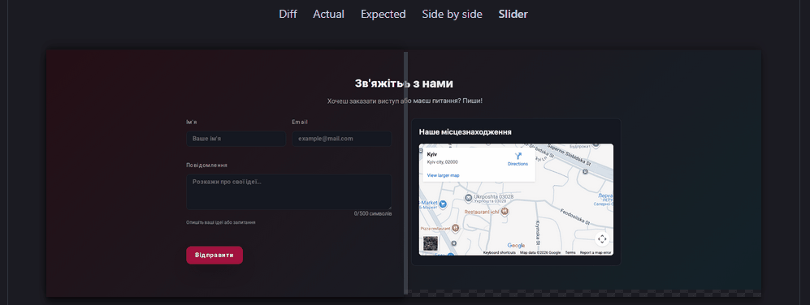

#### Footer

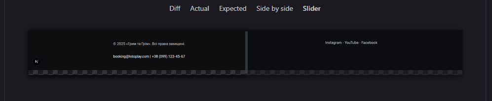

#### Mobile


#### Full Page


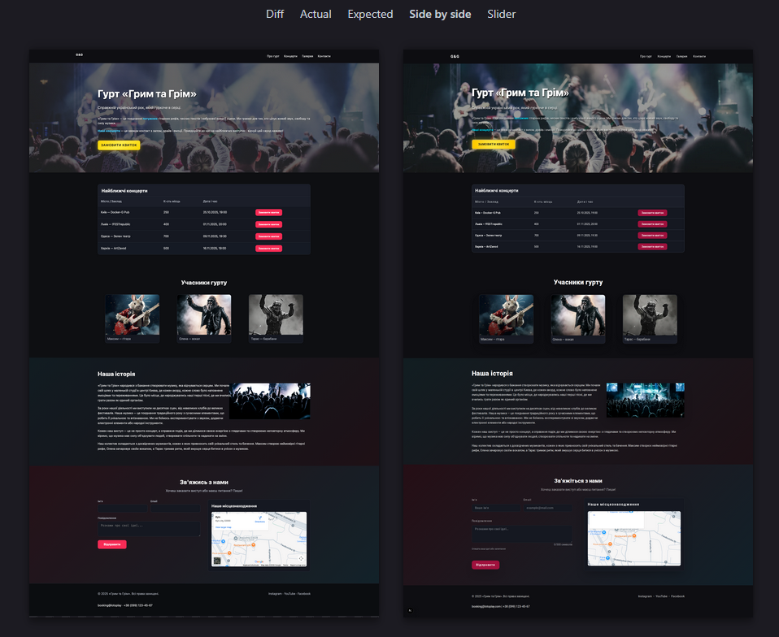

## 🚀 Розгортання

### Локальний розвиток

```bash
# Встановити залежності
pnpm install

# Запустити dev сервер
pnpm dev

# Запустити в продакшн режимі
pnpm build && pnpm start
```

### Environment Variables

```bash
# Тестове середовище (для Playwright)
NEXT_PUBLIC_TEST_ENVIRONMENT=true

# Contact Form Configuration
ARCJET_KEY=your_arcjet_key_here
RESEND_API_KEY=your_resend_api_key_here
RESEND_FROM_EMAIL=onboarding@resend.dev
CONTACT_EMAIL=delivered@resend.dev
```

### Production Deployment

Рекомендовані платформи:

- **Vercel** (рекомендовано для Next.js)

## 📝 Скрипти

```json
{
  "dev": "next dev",
  "build": "next build", 
  "start": "next start",
  "lint": "eslint",
  "test": "playwright test",
  "test:screenshot": "playwright test --update-snapshots",
  "test:headed": "playwright test --headed",
  "test:debug": "playwright test --debug",
  "test:report": "playwright show-report",
  "react-doctor": "react-doctor . --verbose",
  "react-doctor:diff": "react-doctor . --verbose --diff",
  "lighthouse": "npx lighthouse --port=9222 --view --output=html --output-path=./reports/lighthouse.html http://localhost:3000",
  "lighthouse:setup": "google-chrome --headless --remote-debugging-port=9222",
  "lighthouse:json": "npx lighthouse --port=9222 --output=json --output-path=./reports/lighthouse.json http://localhost:3000",
  "lighthouse:mobile": "npx lighthouse --port=9222 --view --output=html --output-path=./reports/lighthouse-mobile.html --form-factor=mobile http://localhost:3000",
  "lighthouse:desktop": "npx lighthouse --port=9222 --view --output=html --output-path=./reports/lighthouse-desktop.html --form-factor=desktop http://localhost:3000",
  "lighthouse:mobile-json": "npx lighthouse --port=9222 --output=json --output-path=./reports/lighthouse-mobile.json --form-factor=mobile http://localhost:3000",
  "lighthouse:desktop-json": "npx lighthouse --port=9222 --output=json --output-path=./reports/lighthouse-desktop.json --form-factor=desktop http://localhost:3000",
  "lighthouse:all": "npm run lighthouse:mobile && npm run lighthouse:desktop"
}
```

## 🤝 Внесок

1. Fork проекту
2. Створіть feature branch (`git checkout -b feature/amazing-feature`)
3. Commit ваші зміни (`git commit -m 'Add amazing feature'`)
4. Push до branch (`git push origin feature/amazing-feature`)
5. Відкрийте Pull Request

## 📄 Ліцензія

© 2025 «Грим та Грім». Всі права захищені.

## 📞 Контакти

- **Email**: booking@lotoplay.com
- **Phone**: +38 (099) 123-45-67
- **Social**: Instagram, YouTube, Facebook

---

*Проект створений з ❤️ до української музики*
